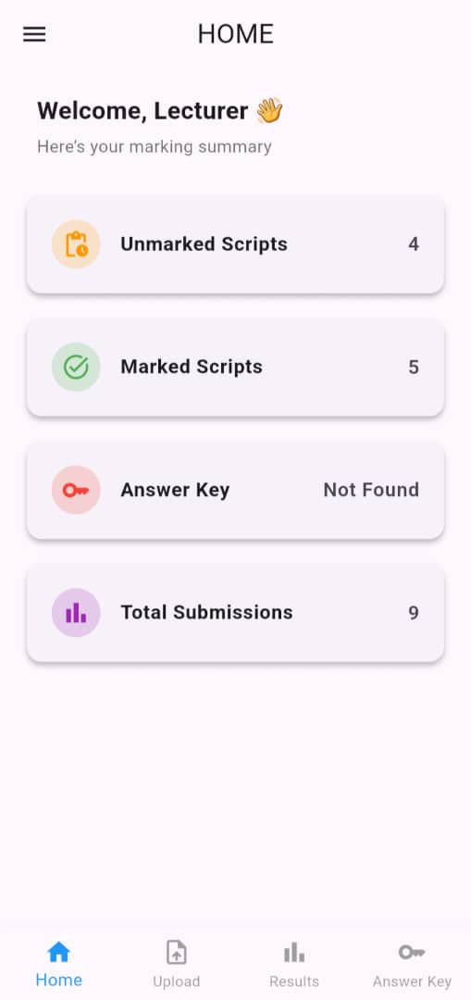
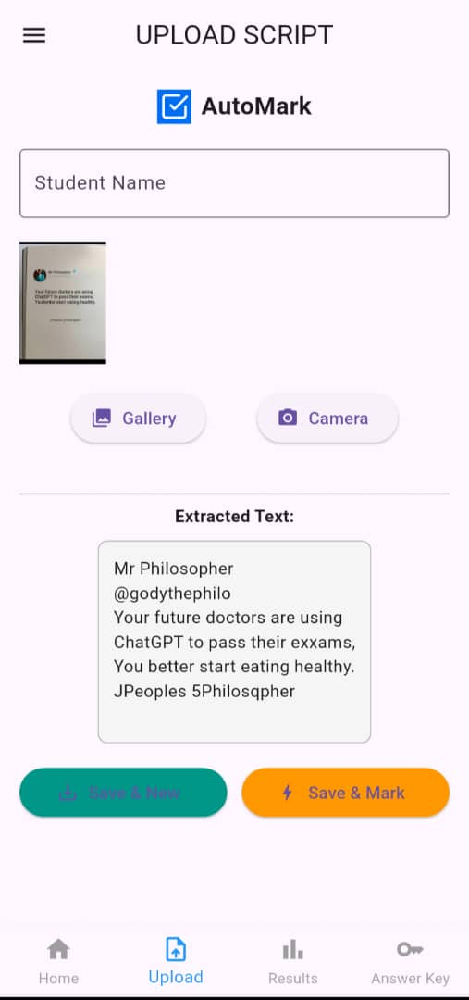
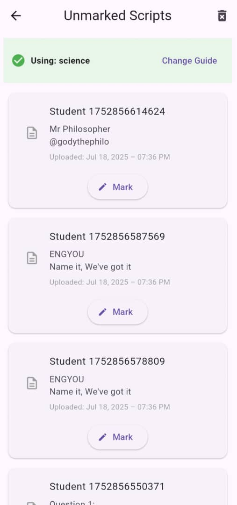
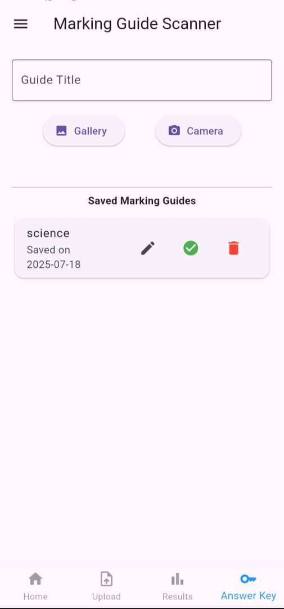
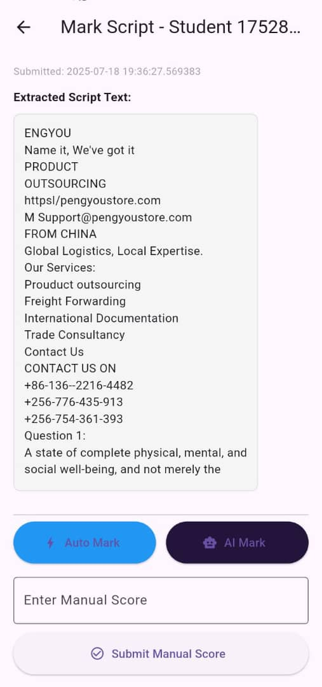
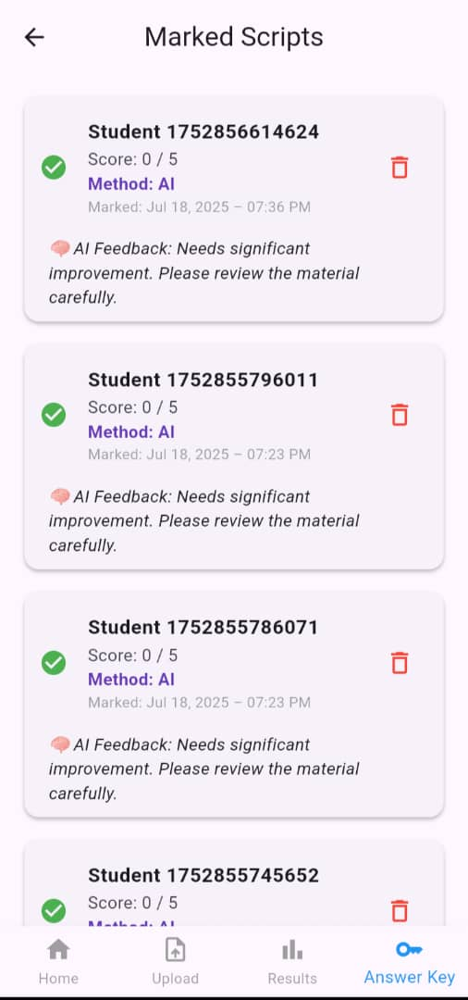
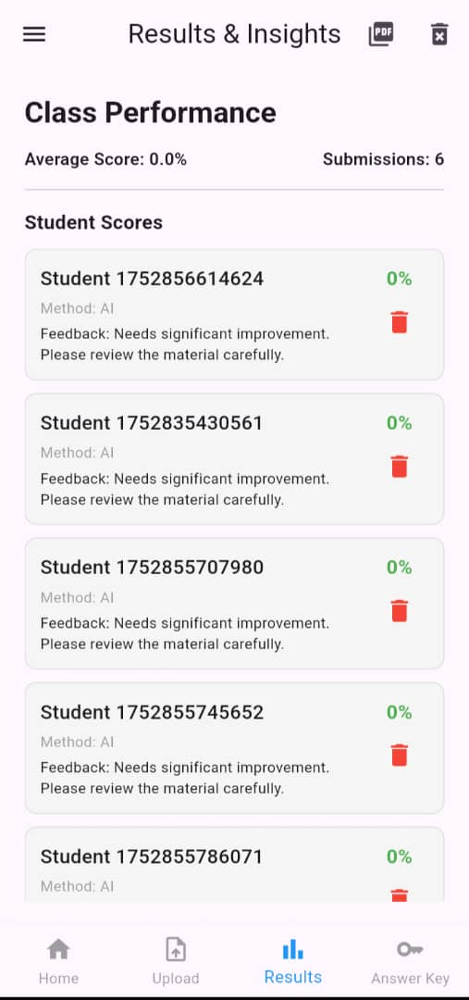

 patrick
# AutoMark – Smart Grading Assistant

**AutoMark** is a mobile application designed to help **Educators (Teachers and Lecturers)** automatically mark student exam scripts and assign grades with the assistance of **AI and OCR (Optical Character Recognition)** and also generate a pdf for the results.

The app simplifies the grading process by offering two main options:

* **Auto-Marking** (Keyword Matching & Logic-based Grading)
* **AI Marking** (Contextual Feedback & Scoring using AI)

AutoMark allows users to scan or upload exam scripts, extract answers, compare them with a preloaded answer key, and generate grades automatically. It also provides options for **manual override**, **result storage**, and **report generation**.


## Mobile App Features

### **Key Screens & Functionalities**
* **HomeScreen** - Central Hub with navigation cards to access certain screens like screens for unmarked scripts
* **Upload Script Screen** - Upload student exam script currently as images(either using a phone camera or directly from the gallery), file uploads planned in future versions.
* **Unmarked Scripts Screen** - View all uploaded scripts awaiting marking. Each script is shown as a card.
* **AnswerKey Screen(Marking-guides)** - Perform actual Marking. Choose between Auto-Marking or AI-Based Marking.
* **Marked Scripts Screen** - View all marked scripts along with feedback(ai), score and also method used for marking
* **Results Screen** - Displays the student names(or numbers) with their scores in percentage form , includes an option to generate a PDF report for subject.
* **Payments Screen(Planned)** - integration with MTN Mobile Money API to unlock premium features like bulk grading, analytics or advanced reporting. 

## Project Website

Visit our project website for:

*  **Project Overview**
*  **Team Roles & Contributions**
*  **App Screenshots**
*  **GitHub Repository Link**
*  **APK Download ***

**Hosted on GitHub Pages:**
 [AutoMark Project Website](https://Lyazi-Patrick.github.io/AutoMark-CS-Project/website/)


## Technologies Used
Flutter(Dart) - Cross platform mobile app development
Google ML kit - OCR text Extraction
RESTFUL API  - Backend communication
MTN Mobile Money API - In-app payments for premium features
Github Pages - Website hosting
HTML/CSS - Static website Frontend

## Backend & API Integration

### MTN Mobile Money API *(Planned)*

AutoMark will integrate the **MTN Mobile Money Open API** to handle secure payments. Users will be able to:

* Unlock bulk marking features
* Access downloadable student reports
* Enable long-term script storage or print services


## Getting Started (Developers)

### 1 Clone the Repository

```bash
git clone https://github.com/Lyazi-Patrick/AutoMark-CS-Project
```

### 2 Prerequisites
Flutter SDK - ver 3.10.00 
Dart - ver 3.0
Android Studio/Vscode - For device emulation or APK building
MTN Developer Account - For MOMO API keys
Google ML kit API key - for OCR


### 3 Running the Mobile App

```bash
cd mobile
flutter pub get
flutter run
```

> Ensure your device or emulator is connected.

### 4 API Setup

If using the backend:

* Implement REST API endpoints as shown above
* Configure `.env` or secure storage for API keys (MTN MoMo, Google ML Kit, and AI key)


##  Screenshots

### **Mobile App Screens**
<div align="center">
<h3>Home Screen</h3>


<h3>Upload Script</h3>


<h3>Unmarked Scripts</h3>


<h3>Marking Guide</h3>


<h3>Marking Screen</h3>


<h3>Marked Scripts</h3>


<h3>Results & PDF Generation</h3>


- Payments(Planned) - 

<div>

##  Project Structure

```
/mobile      -> Flutter app (Android/iOS code)
/website     -> Static website for project showcase
/screenshots -> App screenshots for README and documentation
/README
/LICENSE
```


## Group Members

| Name                  | Registration Number |
|------|---------------------|
| [Lyazi Patrick](https://github.com/Lyazi-Patrick)   | 24/U/06571/PS|
| [Kato Adrian Mugerwa](https://github.com/Wolfhaize)   | 24/U/25909/PS |
| [Ssekidde Jovan](https://github.com/Jovans-code)   | 24/U/24746/PS |
| [Wanswa Drake](https://github.com/ffne4)   | 24/U/20699/PS |
| [Mila Samantha Likiya ](https://github.com/Samantha7404)   | 24/U/24201/PS|


##  License

This project is licensed under an **Academic Project License**.
Use is allowed for **academic demonstration purposes only**.

[View Full License](./LICENSE)


## Acknowledgments

* Makerere University, Department of Computer Science
* MTN MoMo Developer Platform
* Google ML Kit


##  Contact

For any inquiries, reach out via GitHub issues or email the project team.

